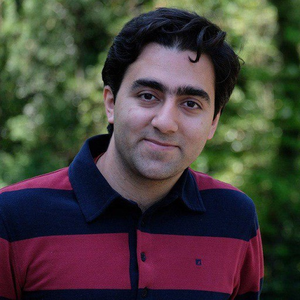

# Dr Koorosh Aslansefat

**Assistant Professor in Computer Science, University of Hull**

I work on AI safety, trustworthy machine learning, explainable AI, and dependability for safety-critical and autonomous systems. My research develops practical methods, tools, and assurance workflows for using AI responsibly in settings where failure matters.

[Research](research.md){ .md-button .md-button--primary }
[Funding](funding.md){ .md-button }
[Publications](publications.md){ .md-button }
[Download CV](CV.pdf){ .md-button }

> "Trustworthy AI is not only about better models. It is about evidence, monitoring, explanation, and responsible deployment."

## Looking for a PhD or MSc by Research?

I welcome enquiries from motivated PhD and MSc by Research candidates interested in AI safety, responsible LLMs, multimodal alignment, explainable AI, safety-critical systems, autonomous systems, digital twins, and dependable machine learning.

Good fits are students who enjoy both theory and implementation: building methods, evaluating them carefully, and turning research into tools that other engineers and researchers can use.

## Research Interests

- **AI safety and alignment**

    Safety monitoring for large language models, multimodal AI systems, responsible AI frameworks, and collaborative alignment workflows.

- **Machine learning dependability**

    Runtime monitoring, uncertainty quantification, robustness evaluation, and statistical safety measures for data-driven systems.

- **Explainable AI**

    Model-agnostic interpretation, robust local explanations, SMILE/XWhy, and evidence that humans can use during assurance.

- **Safety-critical and autonomous systems**

    Dependability assessment, runtime assurance, drones, multi-robot systems, fault diagnosis, and model-based safety engineering.

## Latest Papers

<!-- AUTO_PUBLICATIONS_NEWS_START -->
- **10 Jul 2026** - New preprint: [ConceptSMILE: Auditing the Trustworthiness of Concept-Based Explainable AI](https://doi.org/10.48550/arxiv.2607.09649) in arXiv (Cornell University).
- **03 Jul 2026** - New conference paper: [When Words Move Markets: Interpretable Behavioural and Robustness Analysis of LLMs for Financial Sentiment Reasoning via Local Perturbation Explanations](https://doi.org/10.1007/978-3-032-29532-3_19) in Lecture notes in computer science.
- **01 Jul 2026** - New preprint: [Bayesian Uncertainty Propagation for Agentic RAG Pipelines: A Proof-of-Concept Study on Multi-Hop Question Answering](https://doi.org/10.48550/arxiv.2607.00972) in arXiv (Cornell University).
- **28 Apr 2026** - New preprint: [Risk Assessments for Evasive Emergency Maneuvers in Autonomous Vehicles](https://doi.org/10.48550/arxiv.2604.26050) in arXiv (Cornell University).
- **10 Apr 2026** - New data paper: [A Multi-Modal Dataset for Ground Reaction Force Estimation Using Consumer Wearable Sensors](https://doi.org/10.1038/s41597-026-07183-6) in Scientific Data.
<!-- AUTO_PUBLICATIONS_NEWS_END -->

## Latest News

**2025** - Academic Lead for an Innovate UK project on trustworthy AI agents for incident management with Veracity Healthcare.

**2024-2025** - TrustLLM project launched to investigate responsible and trustworthy LLM use for planning law.

**2024** - SafeLLM work on domain-specific safety monitoring for large language models appeared in *IOP Journal of Physics*.

**2024** - Ongoing collaborations include QinetiQ, Google, Microsoft, Walton & Co Ltd, Connexin, and IIT Madras.

**2023** - SafeML was recommended in German Industry Standard DIN SPEC 92005 for ML uncertainty quantification.

## Selected Highlights

| Area | Highlights |
| --- | --- |
| Research output | 65+ publications across AI safety, dependability, explainability, and safety-critical systems. |
| Impact | SafeML recommended in German Industry Standard DIN SPEC 92005. |
| Funding | Approximately £1.237M funded portfolio, including £285K as PI, Academic Lead, or Co-PI and £952K through wider Co-I collaborations. |
| Supervision | Supervision across responsible LLMs, medical AI safety, fairness, wind-energy AI, generative AI explainability, and EdgeAI. |
| Open source | SafeML, SafeDrones, XWhy/SMILE, and related dependability tooling. |

## Contact

For research collaboration, PhD or MSc by Research enquiries, invited talks, and academic service, use the links below.

[Email](mailto:k.aslansefat@hull.ac.uk){ .md-button .md-button--primary }
[Google Scholar](https://scholar.google.com/citations?user=YBa4Tl8AAAAJ){ .md-button }
[GitHub](https://github.com/koo-ec){ .md-button }
[LinkedIn](https://www.linkedin.com/in/koorosh-aslansefat){ .md-button }

